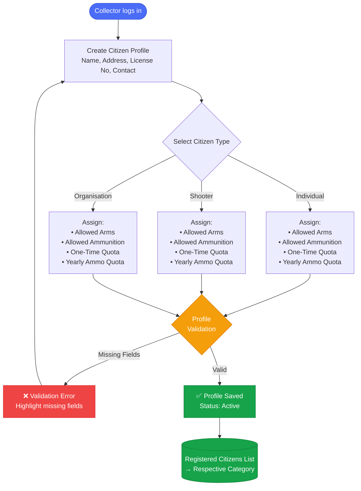

# ALIMS — Citizen Onboarding Flow
## Arms License & Inventory Management System

> **Starting Actor:** Collector Office  
> **Scope:** Citizen Onboarding → Active Registration

---

## Pre-Requisites

- Citizen data will be imported from the **NDAL system** through API integration.
- NDAL will provide details such as **NDAL Number, Name, License Type, License Validity, Address,** and **Status**.
- Citizen type (**Individual, Shooter, or Organisation**) will be identified from the license details.
- Permitted Arms, Ammunition, and applicable Quotas will be assigned based on the license information.
- Only successfully onboarded and verified records will become **active** in the system.

---

## Citizen Onboarding Flow

## DocTypes Used
| 
NDAL Citizen Profile 
|
|Citizen Arms Quota List|
|Citizen Ammunition Quota list |
|NDAL Citizen License List |

---

*Document: onboarding_citizen.md | System: ALIMS v1.0 | Actor: Collector Office*
