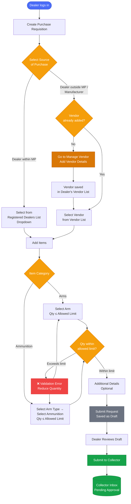

# ALIMS — System Process Flow
## Arms License & Inventory Management System

> **Starting Actor:** Dealer

## . Dealer Purchase Requisition Flow

### Pre-Requisites

- Dealer must be logged into the ALIMS Portal with an active profile.
- Dealer quotas for Arms and Ammunition must be configured.
- Current Stock and Available Stock must be updated in the system.
- Permitted Arms and Ammunition must be mapped to the dealer profile.

---

### Purchase Requisition Flow

## DocTypes Used

- NDAL Dealer Profile
- Vendor Master
- Procurement Arms List
- Procurement Ammunition List
- Dealer NOC
---

*Document: ALIMS_flow.md | System: ALIMS v1.0 | Actor: Collector Office / Dealer*
