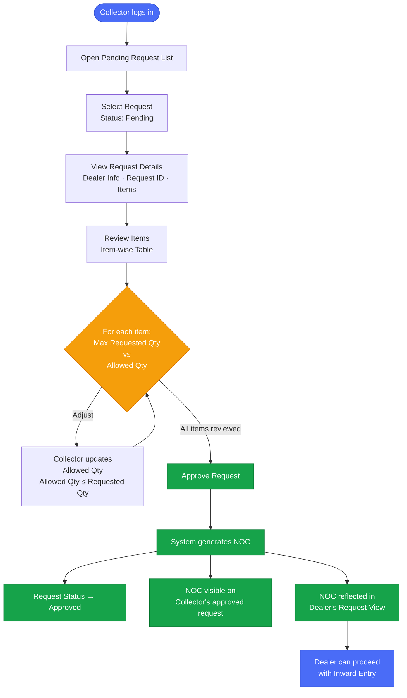
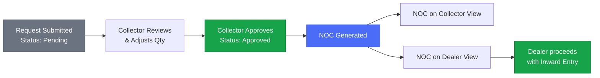

# ALIMS — Purchase Request Approval Flow
## Actor: Collector Office

---

## Pre-Requisites

- Dealer must have submitted a Purchase Requisition within assigned Arms and Ammunition quota limits.
- System must have generated a unique **Request ID** upon successful submission.
- Submitted request must be available in the **Collector's Pending Request List**.
- Collector must be able to view all requested items with item-wise quantities.
- Requested quantities must not exceed the dealer's configured quota limits.

---

## Approval Flow

---

## Item Review Table — What Collector Sees

| Field | Description |
|---|---|
| Item Name | Arm / Ammunition name |
| Category | Arms or Ammunition |
| Max Qty | Maximum allowed quantity for specific item |
| Requested Qty | Quantity requested by dealer |
| Allowed Qty | Editable — Collector sets this (≤ Requested Qty) |

---

## Status & NOC Flow

## DocTypes Used
|  DM USER |
| Dealer Procurement Request |
| Dealer NOC |

---

*Document: ALIMS_purchase_approval_flow.md | System: ALIMS v1.0 | Actor: Collector Office*
