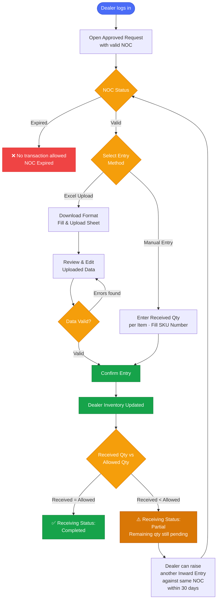

# ALIMS — Inward Entry Flow
## Actor: Dealer

---

## Pre-Requisites

- Purchase Requisition must be approved by the Collector.
- A valid NOC must be generated against the approved request.
- NOC is valid for **30 days** from the date of issuance.
- All item receipts and stock entries must be completed within NOC validity.
- Once NOC expires, status changes to **Expired** — no further transactions allowed.

---

## Inward Entry Flow

---

## Receiving Status Logic

| Condition | Receiving Status |
|---|---|
| Received Qty = Allowed Qty | Completed |
| Received Qty < Allowed Qty | Partial — further inward allowed within 30 days |
| NOC expired before completion | Expired — no further entry |

## DocTypes Used
| Dealer Stock Ledger Entry |
| NDAL Dealer Profile |
| Dealer NOC |
| Stock Item List |

---

*Document: ALIMS_inward_entry_flow.md | System: ALIMS v1.0 | Actor: Dealer*
