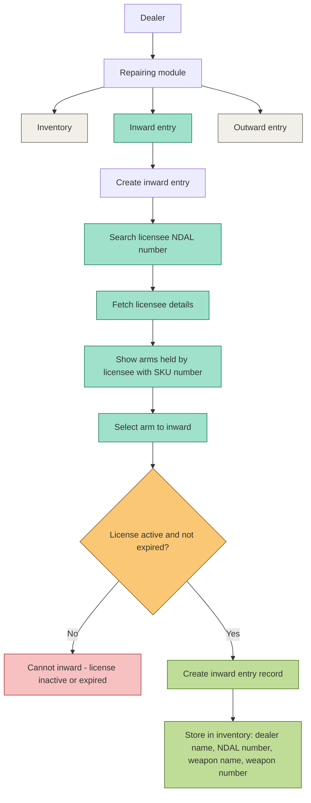

# Repairing Module — Inward Entry Flow

## Inward Entry — Conditional Scenarios Matrix (mapped to wireframe screens)

| # | Scenario | NDAL Search Result | License Status | Arm Selected | System Behavior | Data Stored? | Wireframe Screen |
|---|----------|--------------------|-----------------|---------------|------------------|---------------|-------------------|
| 1 | Valid NDAL, active license, arm available | Found | Active | Yes | Inward entry created | Yes | S3 → S4 → S5 → S6 |
| 2 | Valid NDAL, but license expired | Found | Expired | - | Reject - cannot inward | No | S2 (after Fetch Details) |
| 3 | Valid NDAL, but license inactive/suspended | Found | Inactive | - | Reject - cannot inward | No | S2 (after Fetch Details) |
| 4 | NDAL number does not exist | Not found | - | - | Show error - licensee not found | No | S2 |
| 5 | NDAL exists but licensee has zero arms held | Found | Active | No arms available | Show "No arms found for this licensee" | No | S3 |
| 6 | Licensee has arms, but selected arm already inward (duplicate SKU) | Found | Active | Yes (duplicate) | Reject - "Arm already in inventory" | No | S3 |
| 7 | Dealer selects multiple arms in one go | Found | Active | Multiple | Create entry with multiple SKUs listed | Yes | S3 → S5 (Selected Arms list) |
| 8 | Selected item is Ammunition, not Arm | Found | Active | Ammunition item | Reject - "Repairing accepts Arms only" | No | S3/S4 (warning banner) |
| 9 | License active but near expiry (grace period, if applicable) | Found | Active (near expiry) | Yes | Allow inward + optional warning shown | Yes | S3 |
| 10 | Dealer cancels mid-flow (before final submit) | Found | Any | Selected but not submitted | No entry created, modal closed | No | S2 / S3 / S4 (X button) |
| 11 | Reason / Inward date left blank | Found | Active | Yes | Block "Review Entry" - mandatory field error | No | S4 |
| 12 | Network/API failure during NDAL search | Timeout/error | - | - | Show retry error, no partial data | No | S2 |
| 13 | Network/API failure after license valid, before save | Found | Active | Yes | Rollback, show error, no partial entry | No | S5 (on submit) |
| 14 | Arm SKU already inward by a different dealer | Found | Active | Yes | Reject - "SKU already assigned elsewhere" | No | S3 |
| 15 | Licensee record exists but is blacklisted/flagged | Found | Blacklisted | - | Reject - "Licensee flagged, contact admin" | No | S2 |
| 16 | Dealer re-opens same NDAL after successful inward (re-check) | Found | Active | Remaining arms shown (already-inward ones excluded) | Normal flow continues | Yes (for new selection) | S2 → S3 |
| 17 | Entry submitted successfully | Found | Active | Yes | Show "Entry Recorded Successfully" confirmation | Yes | S6 |

