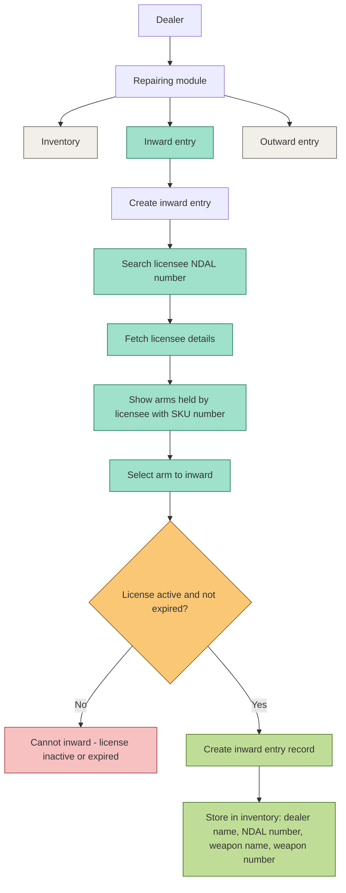

# Repairing Module — Inward Entry Flow

## Inward Entry — Conditional Scenarios Matrix (detailed, wireframe-mapped)

| # | Scenario | Screen / Modal | Field(s) Involved | Button/Action Triggering It | System Behavior | Data Stored? |
|---|----------|-----------------|--------------------|------------------------------|------------------|---------------|
| 1 | Valid NDAL, active license, arm available, entry completed | Step 1 → Step 2 → Step 3 (New Inward Entry modal) | NDAL Number, Assigned Arms checklist, Repairing Reason, Inward Date | "Fetch Details" → checkbox select → "Review Entry" → "Accept into Repairing Inventory" | Entry created, success modal shown | Yes |
| 2 | Valid NDAL, but license expired | Step 1: Licensee Lookup | NDAL Number input | "Fetch Details" | Block progression to Step 2, show "License expired" error under NDAL field | No |
| 3 | Valid NDAL, but license inactive/suspended | Step 1: Licensee Lookup | NDAL Number input | "Fetch Details" | Block progression to Step 2, show "License inactive" error under NDAL field | No |
| 4 | NDAL number does not exist in system | Step 1: Licensee Lookup | NDAL Number input | "Fetch Details" | Show "Licensee not found" error, licensee card stays empty | No |
| 5 | NDAL exists but licensee has zero arms held | Step 2: Select Items | Assigned Arms section (list area) | Auto-triggered after Step 1 success | Show "No arms found for this licensee" in place of checklist | No |
| 6 | Selected arm's SKU already exists in an inward entry (duplicate) | Step 2: Select Items | Arm checkbox (e.g. Glock 22 - DL-PIS-0120) | Checkbox tick | Checkbox disabled/greyed with tag "Already inward", cannot select | No |
| 7 | Dealer selects multiple arms | Step 2: Select Items | Multiple arm checkboxes (Glock 22, Colt King Cobra, .22 Rifle) | Multiple checkbox ticks → "Review Entry" | All selected arms carried to Step 3 "Selected Arms" list | Yes (per arm) |
| 8 | Selected item is ammunition, not an arm | Step 2: Select Items | Assigned Arms checklist | Checkbox tick on an ammo-type item (if listed) | Yellow banner shown: "Repairing module accepts Arms only. Ammunition cannot be added to repairing entries." Selection blocked | No |
| 9 | Mandatory field left blank (Repairing Reason or Inward Date) | Step 2: Select Items (bottom form) | "Repairing Reason" text box, "Inward Date" date picker | "Review Entry →" | Button blocked, inline validation error shown under empty field | No |
| 10 | Dealer closes modal mid-flow (any step) | Step 1 / Step 2 / Step 3 | — | "X" close icon (top-right of modal) | Modal closes, no entry saved, list page (Entry ID table) unchanged | No |
| 11 | Dealer clicks "Back" from Step 3 | Step 3: Review & Submit | — | "← Back" button | Returns to Step 2 with previous selections retained | No |
| 12 | Network/API failure while fetching licensee | Step 1: Licensee Lookup | NDAL Number input | "Fetch Details" | Show retry error message, licensee card remains empty placeholder | No |
| 13 | Network/API failure while submitting entry | Step 3: Review & Submit | Entry Summary (Licensee, NDAL, Reason, Selected Arms) | "Accept into Repairing Inventory" | Show error toast, entry not saved, dealer stays on Step 3 to retry | No |
| 14 | Entry submitted successfully | Step 3 → Success modal | Entry Summary fields | "Accept into Repairing Inventory" | Green checkmark modal: "Entry Recorded Successfully", "Close" button returns to list | Yes |
| 15 | Dealer clicks "Close" on success modal | Success confirmation modal | — | "Close" button | Modal closes, Inward Entry list (table) refreshes with new row, Status = "Accepted" or "Pending" | — |
| 16 | New entry appears in list with "Pending" status | Inward Entry list page | Entry ID, Licensee Name, NDAL Number, No. of Arms, Inward Date, Status column | "View" / "Edit" buttons per row | Entry visible in table; "Edit" available only for Pending rows (Accepted rows show only "View") | Already stored |
| 17 | Dealer reopens same NDAL after a successful inward | Step 1 → Step 2 | NDAL Number input, Assigned Arms checklist | "Fetch Details" | Previously-inwarded arms excluded/disabled in checklist, only remaining arms selectable | Yes (for new selection) |