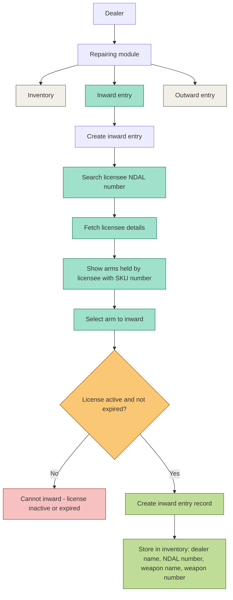

# Repairing Module — Inward Entry Flow

```mermaid
flowchart TD
    A[Dealer] --> B[Repairing module]
    B --> C[Inventory]
    B --> D[Inward entry]
    B --> E[Outward entry]

    D --> F[Create inward entry]
    F --> G[Search licensee NDAL number]
    G --> H[Fetch licensee details]
    H --> I[Show arms held by licensee with SKU number]
    I --> J[Select arm to inward]
    J --> K{License active and not expired?}

    K -->|No| L[Cannot inward - license inactive or expired]
    K -->|Yes| M[Create inward entry record]
    M --> N[Store in inventory: dealer name, NDAL number, weapon name, weapon number]

    style C fill:#f1efe8,stroke:#5f5e5a
    style E fill:#f1efe8,stroke:#5f5e5a
    style D fill:#9fe1cb,stroke:#0f6e56
    style G fill:#9fe1cb,stroke:#0f6e56
    style H fill:#9fe1cb,stroke:#0f6e56
    style I fill:#9fe1cb,stroke:#0f6e56
    style J fill:#9fe1cb,stroke:#0f6e56
    style K fill:#fac775,stroke:#854f0b
    style L fill:#f7c1c1,stroke:#a32d2d
    style M fill:#c0dd97,stroke:#3b6d11
    style N fill:#c0dd97,stroke:#3b6d11
```