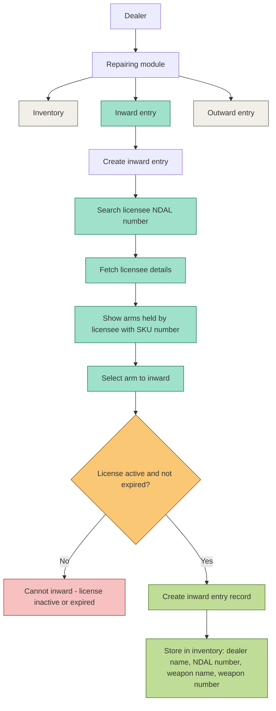

# Repairing Module — Inward Entry Flow

## Inward Entry — Conditional Scenarios Matrix (complete)

| # | Scenario | NDAL Search Result | License Status | Arm Selected | Screen / Modal | Field(s) Involved | Button/Action | System Behavior | Data Stored? |
|---|----------|--------------------|-----------------|---------------|-----------------|--------------------|-----------------|------------------|---------------|
| 1 | Valid NDAL, active license, arm available, entry completed | Found | Active | Yes | Step 1 → Step 2 → Step 3 | NDAL Number, Assigned Arms checklist, Repairing Reason, Inward Date | "Fetch Details" → checkbox select → "Review Entry" → "Accept into Repairing Inventory" | Entry created, success modal shown | Yes |
| 2 | Valid NDAL, but license expired | Found | Expired | - | Step 1: Licensee Lookup | NDAL Number input | "Fetch Details" | Block progression to Step 2, show "License expired" error under NDAL field | No |
| 3 | Valid NDAL, but license inactive/suspended | Found | Inactive | - | Step 1: Licensee Lookup | NDAL Number input | "Fetch Details" | Block progression to Step 2, show "License inactive" error under NDAL field | No |
| 4 | NDAL number does not exist | Not found | - | - | Step 1: Licensee Lookup | NDAL Number input | "Fetch Details" | Show "Licensee not found" error, licensee card stays empty | No |
| 5 | NDAL exists but licensee has zero arms held | Found | Active | No arms available | Step 2: Select Items | Assigned Arms section (list area) | Auto-triggered after Step 1 success | Show "No arms found for this licensee" in place of checklist | No |
| 6 | Selected arm's SKU already exists in an inward entry (duplicate) | Found | Active | Yes (duplicate) | Step 2: Select Items | Arm checkbox (e.g. Glock 22 - DL-PIS-0120) | Checkbox tick | Checkbox disabled/greyed with tag "Already inward", cannot select | No |
| 7 | Dealer selects multiple arms in one go | Found | Active | Multiple | Step 2: Select Items | Multiple arm checkboxes (Glock 22, Colt King Cobra, .22 Rifle) | Multiple checkbox ticks → "Review Entry" | All selected arms carried to Step 3 "Selected Arms" list | Yes, per arm |
| 8 | Selected item is ammunition, not an arm | Found | Active | Ammunition item | Step 2: Select Items | Assigned Arms checklist | Checkbox tick on ammo-type item | Yellow banner: "Repairing module accepts Arms only. Ammunition cannot be added." Selection blocked | No |
| 9 | Mandatory field left blank (Repairing Reason or Inward Date) | Found | Active | Yes | Step 2: Select Items (bottom form) | "Repairing Reason" text box, "Inward Date" date picker | "Review Entry →" | Button blocked, inline validation error under empty field | No |
| 10 | Dealer closes modal mid-flow (before final submit) | Found | Any | Selected but not submitted | Step 1 / Step 2 / Step 3 | — | "X" close icon | Modal closes, no entry saved, list page unchanged | No |
| 11 | Dealer clicks "Back" from Step 3 | Found | Active | Yes | Step 3: Review & Submit | — | "← Back" button | Returns to Step 2 with previous selections retained | No |
| 12 | Network/API failure during NDAL search | Timeout/error | - | - | Step 1: Licensee Lookup | NDAL Number input | "Fetch Details" | Show retry error, licensee card remains empty placeholder | No |
| 13 | Network/API failure while submitting entry | Found | Active | Yes | Step 3: Review & Submit | Entry Summary (Licensee, NDAL, Reason, Selected Arms) | "Accept into Repairing Inventory" | Error toast shown, entry not saved, dealer stays on Step 3 to retry | No |
| 14 | Entry submitted successfully | Found | Active | Yes | Step 3 → Success modal | Entry Summary fields | "Accept into Repairing Inventory" | Green checkmark: "Entry Recorded Successfully", "Close" button | Yes |
| 15 | Dealer clicks "Close" on success modal | Found | Active | Yes | Success confirmation modal | — | "Close" button | Modal closes, Inward Entry list refreshes with new row | Already stored |
| 16 | Arm SKU already inward by a different dealer | Found | Active | Yes | Step 2: Select Items | Arm checkbox | Checkbox tick | Reject - "SKU already assigned elsewhere" | No |
| 17 | Licensee record exists but is blacklisted/flagged | Found | Blacklisted | - | Step 1: Licensee Lookup | NDAL Number input | "Fetch Details" | Reject - "Licensee flagged, contact admin" | No |
| 18 | Dealer re-opens same NDAL after successful inward (re-check) | Found | Active | Remaining arms shown (already-inward excluded) | Step 1 → Step 2 | NDAL Number input, Assigned Arms checklist | "Fetch Details" | Previously-inwarded arms disabled, only remaining arms selectable | Yes, for new selection |