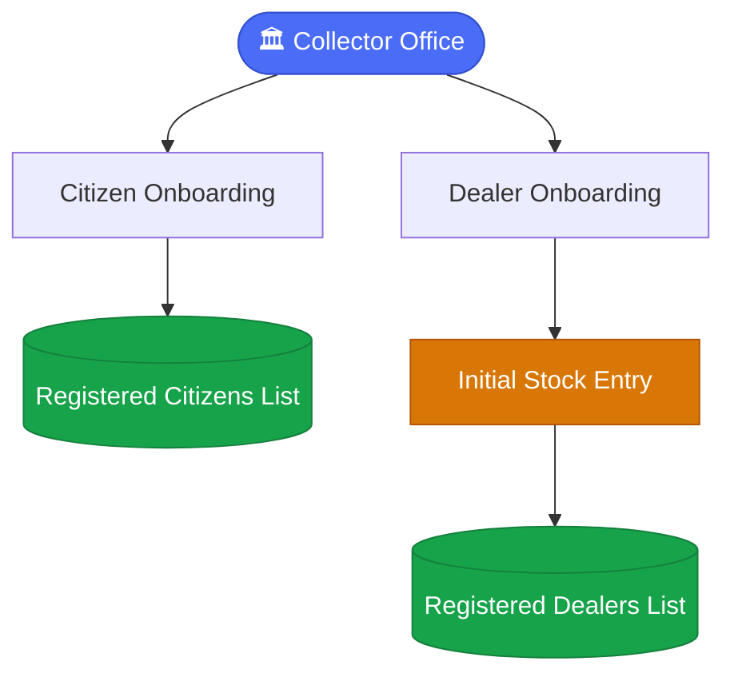
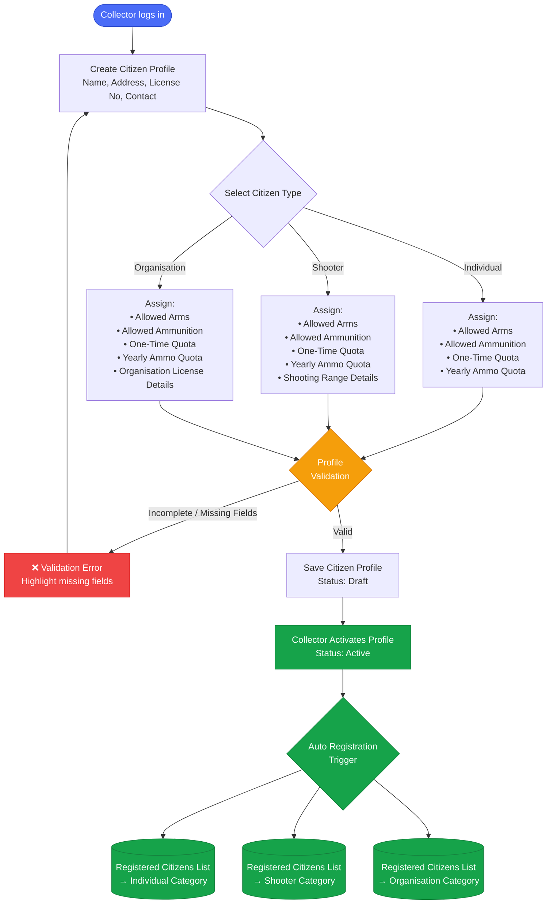
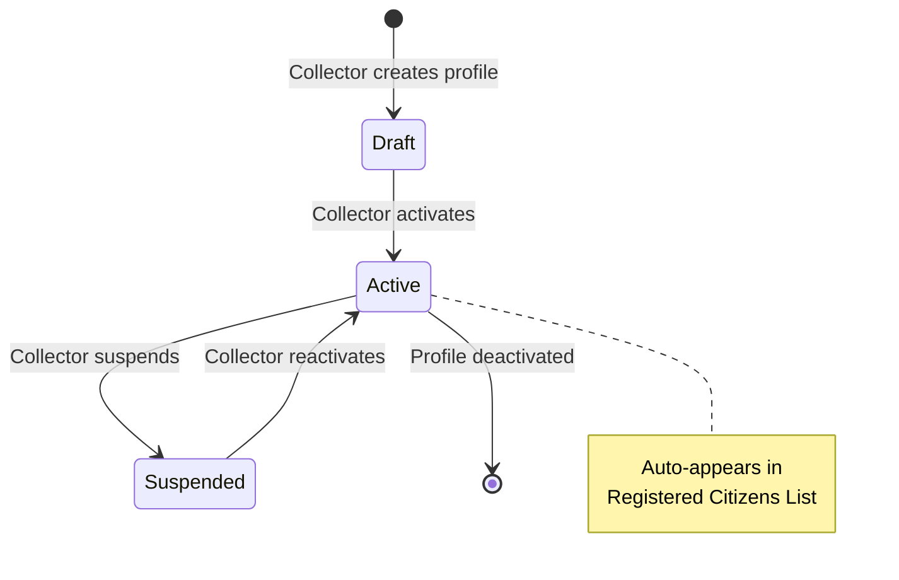
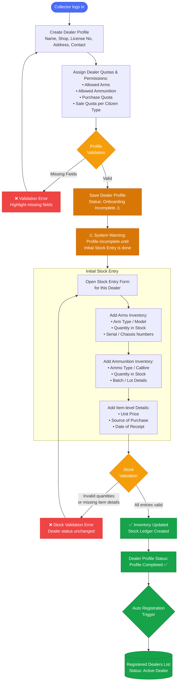
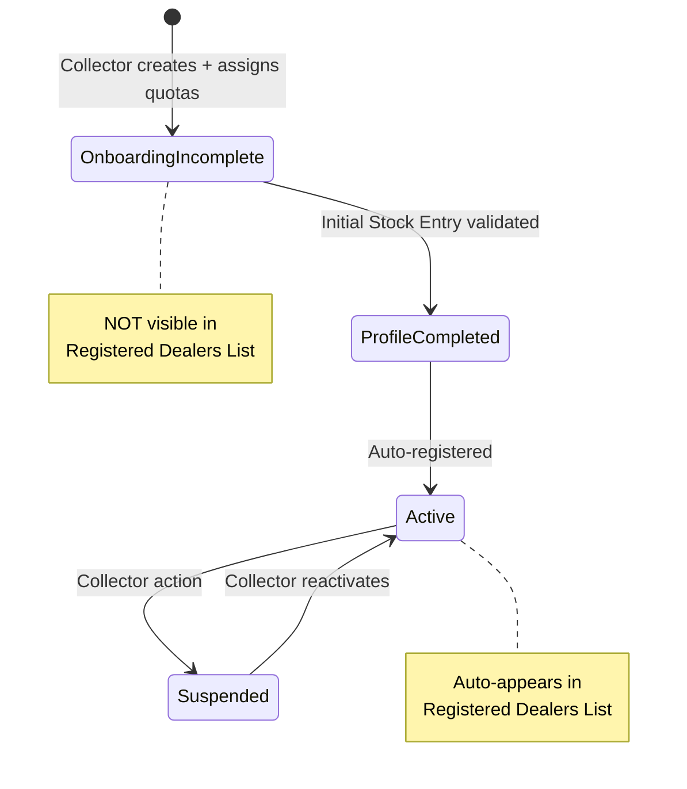
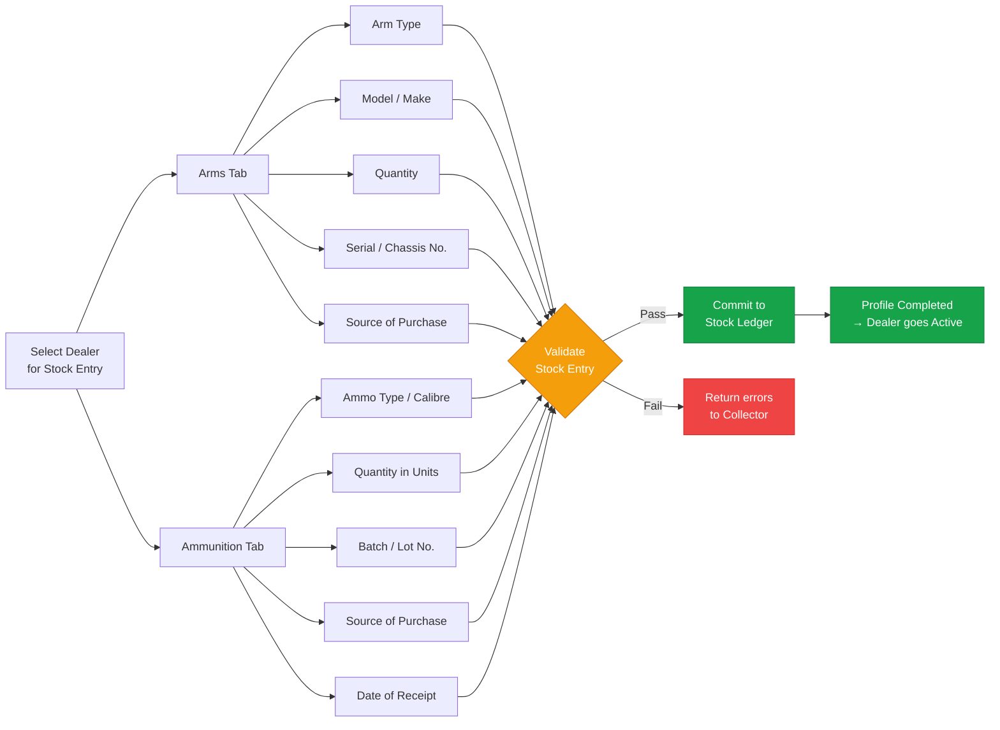
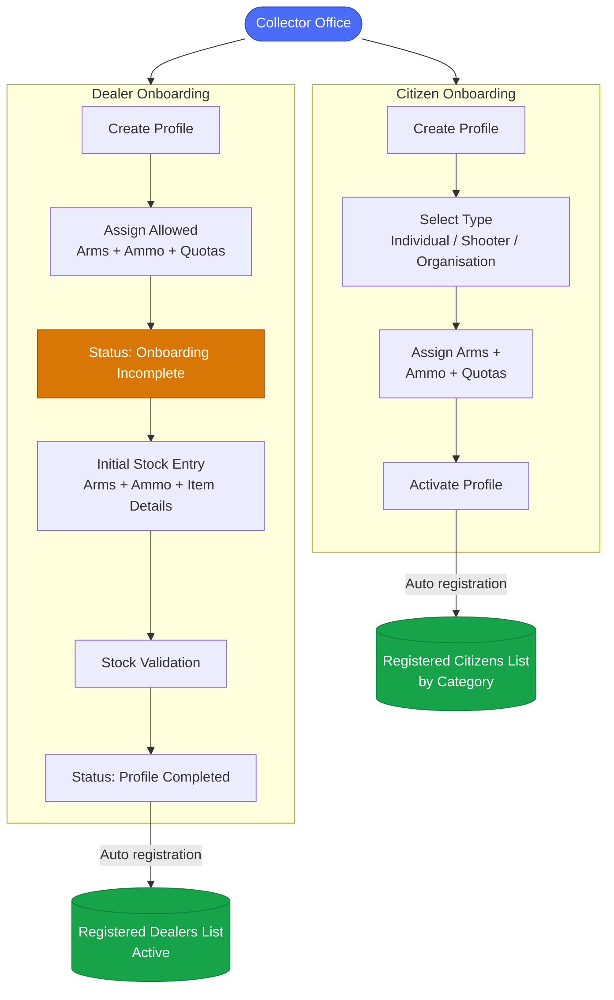

# ALIMS — System Process Flow
## Arms License & Inventory Management System

> **Starting Actor:** Collector Office  
> **Scope:** Citizen Onboarding → Dealer Onboarding → Initial Stock Entry → Active Registration

---

## Overview

---

## 1. Citizen Onboarding Flow

### Citizen Type — Quota Assignment Rules

| Field | Individual | Shooter | Organisation |
|---|---|---|---|
| Allowed Arms | ✅ | ✅ | ✅ |
| Allowed Ammunition | ✅ | ✅ | ✅ |
| One-Time Quota | ✅ | ✅ | ✅ |
| Yearly Ammo Quota | ✅ | ✅ | ✅ |
| Shooting Range Details | ❌ | ✅ | ❌ |
| Organisation License | ❌ | ❌ | ✅ |

### Citizen Profile — Status Transitions

---

## 2. Dealer Onboarding Flow

### Dealer Profile — Status Transitions

---

## 3. Initial Stock Entry — Detail Flow

---

## 4. End-to-End Summary Flow

---

## 5. Key Business Rules

| # | Rule |
|---|---|
| BR-01 | Citizen profile becomes visible in Registered Citizens List **only after** Collector activates the profile. |
| BR-02 | Citizen type selection is **mandatory** before quota assignment. Quotas differ per type. |
| BR-03 | Dealer profile saved after quota assignment is marked **Onboarding Incomplete** — not visible in Registered Dealers List. |
| BR-04 | Dealer registration is **not complete** until Initial Stock Entry is successfully validated. |
| BR-05 | Initial Stock Entry must cover **both Arms and Ammunition** inventory. Partial entry fails validation. |
| BR-06 | On successful stock validation, dealer status auto-transitions to **Profile Completed** and dealer appears in Registered Dealers List as **Active**. |
| BR-07 | Stock Ledger is initialised from the Initial Stock Entry — all future purchases and sales are tracked against this base. |
| BR-08 | Citizen auto-appears under their **respective category** (Individual / Shooter / Organisation) in the list — not a single combined list. |

---

*Document: ALIMS_flow.md | System: ALIMS v1.0 | Actor: Collector Office*
