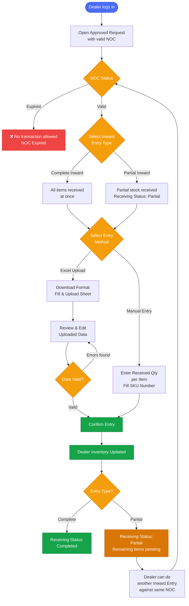

# ALIMS — Inward Entry Flow
## Actor: Dealer

---

## Pre-Requisites

- Purchase Requisition must be approved by the Collector.
- A valid NOC must be generated against the approved request.
- NOC is valid for **30 days** from the date of issuance.
- All item receipts and stock entries must be completed within NOC validity.
- Once NOC expires, status changes to **Expired** — no further transactions allowed.

---

## Inward Entry Flow

---

## Receiving Status Summary

| Scenario | Receiving Status |
|---|---|
| All items received in one go | Completed |
| Partial stock received | Partial |
| NOC expired before completion | Expired — no further entry |

---

*Document: ALIMS_inward_entry_flow.md | System: ALIMS v1.0 | Actor: Dealer*
