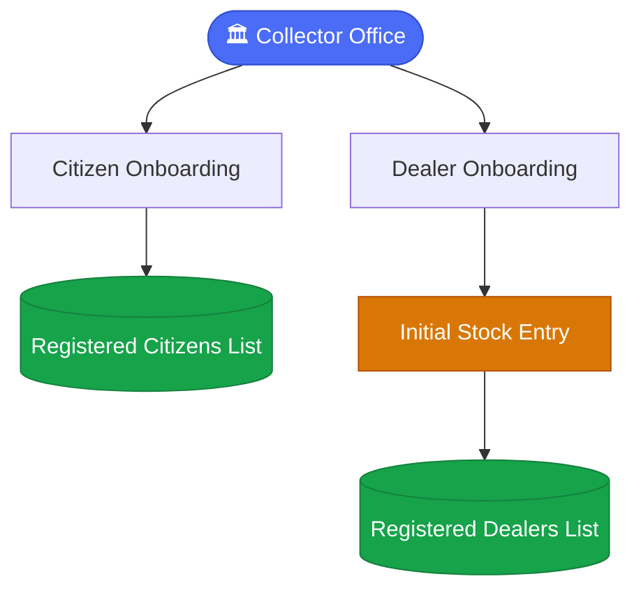
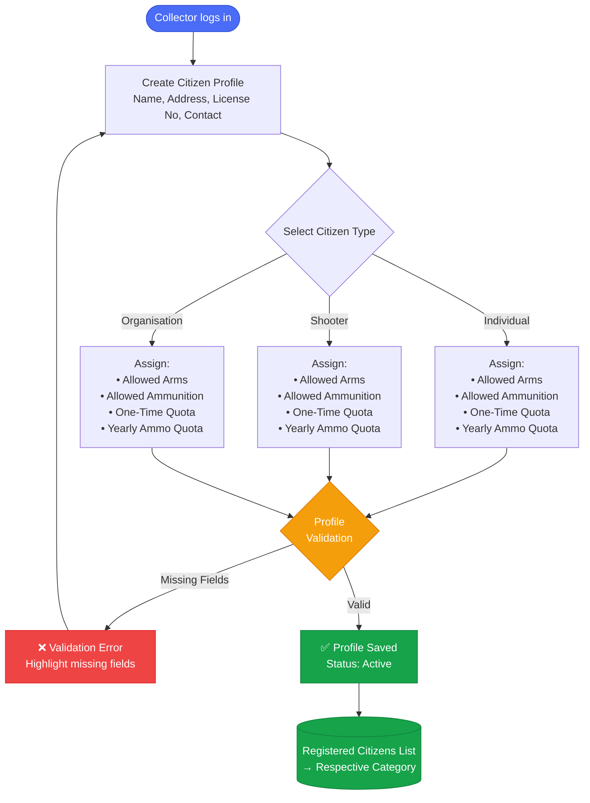
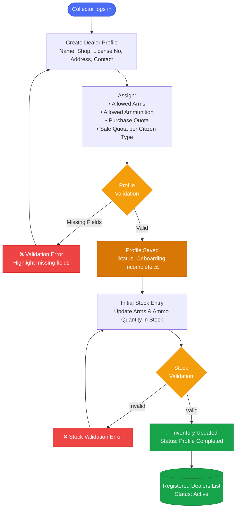
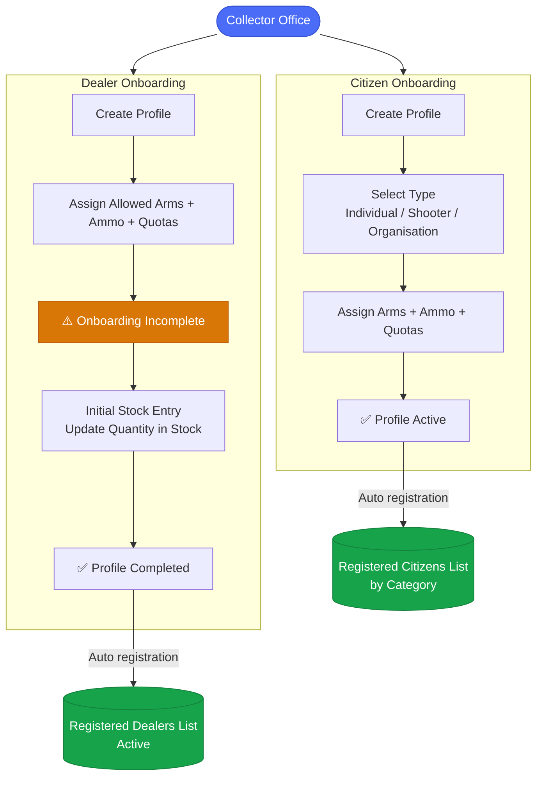
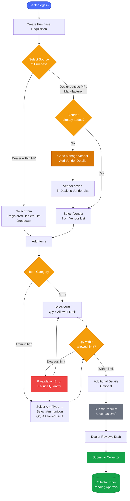

# ALIMS — System Process Flow
## Arms License & Inventory Management System

> **Starting Actor:** Collector Office  
> **Scope:** Citizen Onboarding → Dealer Onboarding → Initial Stock Entry → Active Registration

---

## Pre-Requisites

> The following conditions must be met before the onboarding process begins in ALIMS.

- Citizen and Dealer data will be imported from the **NDAL system** through API integration.
- NDAL will provide details such as **NDAL Number, Name, License Type, License Validity, Address,** and **Status**.
- Imported data will be used to onboard Citizens and Dealers in ALIMS.
- Citizen type (**Individual, Shooter, or Organisation**) will be identified from the license details.
- Permitted Arms, Ammunition, and applicable Quotas will be assigned based on the license information.
- Only successfully onboarded and verified records will become **active** in the system.

---

## Overview

---

## 1. Citizen Onboarding Flow

---

## 2. Dealer Onboarding Flow

---

## 3. End-to-End Summary

---

*Document: ALIMS_flow.md | System: ALIMS v1.0 | Actor: Collector Office*

---

## 4. Dealer Purchase Requisition Flow

### Pre-Requisites

- Dealer must be logged into the ALIMS Portal with an active profile.
- Dealer quotas for Arms and Ammunition must be configured.
- Current Stock and Available Stock must be updated in the system.
- Permitted Arms and Ammunition must be mapped to the dealer profile.

---

### Purchase Requisition Flow

---

*Document: ALIMS_flow.md | System: ALIMS v1.0 | Actor: Collector Office / Dealer*
