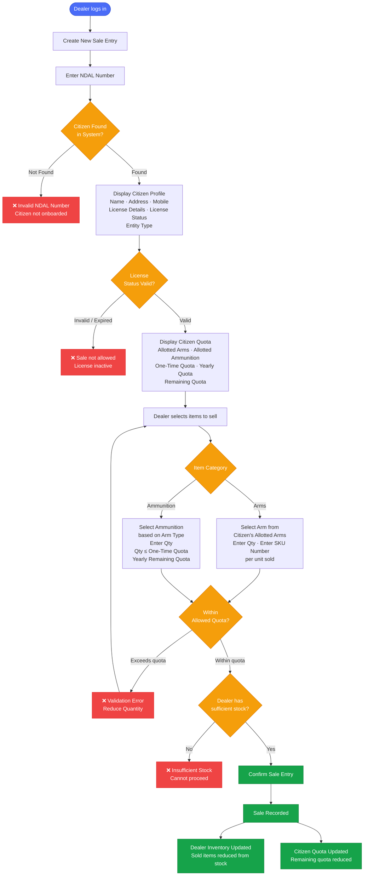
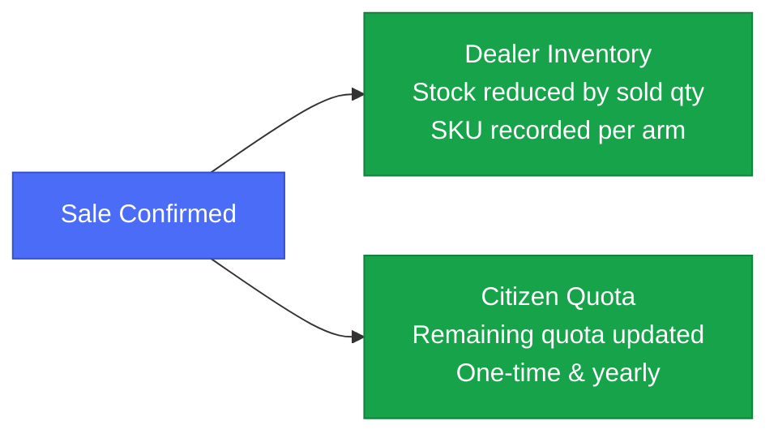

# ALIMS — Sales Flow
## Actor: Dealer

---

## Pre-Requisites

- Dealer must be logged into the ALIMS Portal.
- Dealer must have sufficient stock available in inventory.
- Citizen profile must be onboarded and available in the system.
- Citizen details — Name, Address, Mobile, License Details, License Status, and Entity Type (Individual, Shooter, or Organisation) — must be available for verification.
- Citizen quota details including permitted Arms, Ammunition, allotted quantity, and remaining quota must be available.
- Only items permitted under the citizen's license and within available quota can be sold.
- Sales entry can be created only after successful profile verification and quota validation.

---

## Sales Flow

---

## Quota Validation Rules

| Entity Type | Arms | Ammunition |
|---|---|---|
| Individual | As per allotted arms list | One-time qty limit + yearly limit |
| Shooter | As per allotted arms list | One-time qty limit + yearly limit |
| Organisation | As per allotted arms list | One-time qty limit + yearly limit |

> Quota limits differ per entity type — system validates against the citizen's specific configured quota.

---

## Post-Sale Updates

---

*Document: ALIMS_sales_flow.md | System: ALIMS v1.0 | Actor: Dealer*
