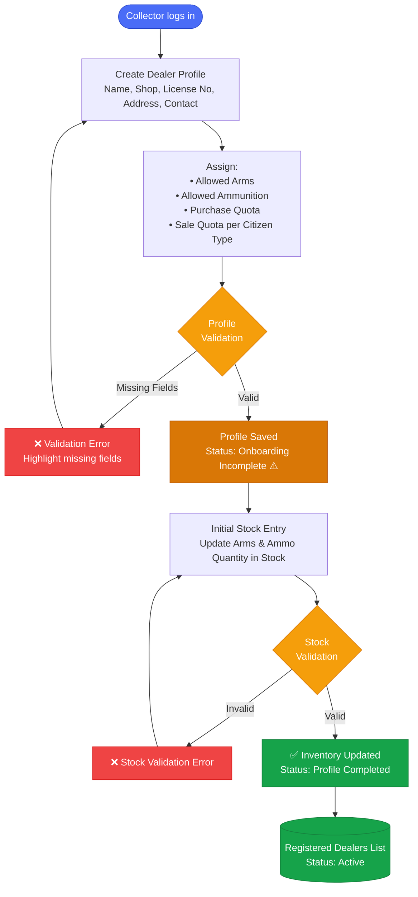

# ALIMS — Dealer Onboarding Flow
## Arms License & Inventory Management System

> **Starting Actor:** Collector Office  
> **Scope:** Dealer Onboarding → Initial Stock Entry → Active Registration

---

## Pre-Requisites

- Dealer data will be imported from the **NDAL system** through API integration.
- NDAL will provide details such as **NDAL Number, Name, License Type, License Validity, Address,** and **Status**.
- Permitted Arms, Ammunition, and applicable Quotas will be assigned based on the license information.
- Only successfully onboarded and verified records will become **active** in the system.
- Initial Stock Entry done during onboarding will remain **editable until the dealer makes their first transaction**.

---

## Dealer Onboarding Flow

---

*Document: onboarding_dealer.md | System: ALIMS v1.0 | Actor: Collector Office*
